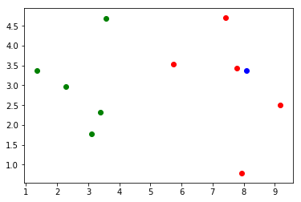

# kNN 算法
### 应用简单实现
根据下述过程可以看到，可以说kNN是一个不需要训练过程的算法。

k近邻算法是非常特殊的，可以被认为是没有模型的算法。

为了和其他算法统一，可以认为训练数据集就是模型本身。


```python
import numpy as np
import matplotlib.pyplot as plt

raw_data_X = [[3.393, 2.331],
             [3.110, 1.782],
             [1.343, 3.368],
             [3.582, 4.679],
             [2.280, 2.967],
             [7.423, 4.697],
             [5.745, 3.534],
             [9.172, 2.511],
             [7.792, 3.424],
             [7.940, 0.792]]

raw_data_y = [0, 0, 0, 0, 0, 1, 1, 1, 1, 1]

X_train = np.array(raw_data_X)
y_train = np.array(raw_data_y)

x = np.array([8.094, 3.366])
```


```python
plt.scatter(X_train[y_train==0,0], X_train[y_train==0,1], color='g')
plt.scatter(X_train[y_train==1,0], X_train[y_train==1,1], color='r')
plt.scatter(x[0], x[1], color='b')
plt.show()
```





```python
%run kNN_simple_implement.py
```


```python
predict_y = kNN_classify(k=3, X_train=X_train, y_train=y_train, x=x)
predict_y
```


    1


### 使用scikit-learn中的kNN


```python
from sklearn.neighbors import KNeighborsClassifier
```


```python
kNN_classifier = KNeighborsClassifier(n_neighbors=6)
```


```python
kNN_classifier.fit(X_train, y_train)
```


    KNeighborsClassifier(algorithm='auto', leaf_size=30, metric='minkowski',
               metric_params=None, n_jobs=1, n_neighbors=6, p=2,
               weights='uniform')


```python
# 将要预测的数据放入一个矩阵
X_predict = x.reshape(1, -1)
y_predict = kNN_classifier.predict(X_predict)
y_predict[0]
```


    1


### 重新整理kNN代码


```python
%run kNN.py
```


```python
kNN_classifier_re = kNNClassifier(6)
kNN_classifier_re.fit(X_train, y_train)
```


    kNN(k=6)


```python
y_predict_re = kNN_classifier_re.predict(X_predict)
y_predict_re[0]
```


    1


