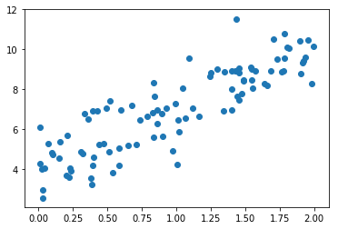

<head>
    <script src="https://cdn.mathjax.org/mathjax/latest/MathJax.js?config=TeX-AMS-MML_HTMLorMML" type="text/javascript"></script>
    <script type="text/x-mathjax-config">
        MathJax.Hub.Config({
            tex2jax: {
            skipTags: ['script', 'noscript', 'style', 'textarea', 'pre'],
            inlineMath: [['$','$']]
            }
        });
    </script>
</head>

# 在线性回归模型中使用梯度下降法

```python
import numpy as np
import matplotlib.pyplot as plt
```

```python
np.random.seed(666)
x = 2* np.random.random(size=100)
y = x * 3. + 4. + np.random.normal(size = 100)
```

```python
X = x.reshape(-1, 1)
```

```python
X.shape
```

(100, 1)

```python
y.shape
```

(100,)

```python
plt.scatter(x, y)
plt.show()
```



## 使用梯度下降法训练

目标：使
$$\frac{1}{m}\sum_{i=1}^m (y^{(i)} - \hat{y}^{(i)})^2$$
尽可能小

$$J(\theta) = MSE(y, \hat{y})$$

$$\nabla J(\theta) = 
\frac{2}{m} \cdot \begin{pmatrix}
\sum_{i=1}^m (X_b^{(i)}\theta - y^{(i)}) \\\\
\sum_{i=1}^m (X_b^{(i)}\theta - y^{(i)}) \cdot X^{(i)}_1 \\\\
\sum_{i=1}^m (X_b^{(i)}\theta - y^{(i)}) \cdot X^{(i)}_2 \\\\
\ldots \\\\
\sum_{i=1}^m (X_b^{(i)}\theta - y^{(i)}) \cdot X^{(i)}_n
\end{pmatrix}$$

```python
def J(theta, x_b, y):
    try:
        return np.sum((y - x_b.dot(theta)) ** 2) / len(x_b)
    except:
        return float('inf')
```

```python
def dJ(theta, x_b, y):
    res = np.empty(len(theta))
    res[0] = np.sum(x_b.dot(theta) - y)
    for i in range(1, len(theta)):
        res[i] = np.sum((x_b.dot(theta) - y).dot(x_b[:,i]))
    return res * 2 / len(x_b)
```

```python
def gradient_descent(x_b, y, initial_theta, eta, n_iters=10000, epsilon=1e-8):
    theta = initial_theta

    i_iter = 0
    while i_iter < n_iters:
        gradient = dJ(theta, x_b, y)
        last_theta = theta
        theta = theta - eta * gradient
        i_iter = i_iter + 1
        if(abs(J(theta, x_b, y) - J(last_theta, x_b, y)) < epsilon):
            break

    return theta
```

```python
x_b = np.hstack([np.ones((len(x), 1)), X])
initial_theta = np.zeros(x_b.shape[1])
eta = 0.01

theta = gradient_descent(x_b, y, initial_theta, eta)
```

```python
theta
```

array([4.02145786, 3.00706277])

```python
%run ../LinearRegression/LinearRegression.py
```

```python
lr = LinearRegression()
lr.fit_gd(X, y)
```

LinearRegression()

```python
lr.interception_
```

4.021457858204859

```python
lr.coef_
```

array([3.00706277])
