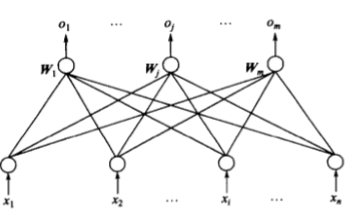

# 监督学习神经网络

感知机神经网络是一种典型的前馈神经网络，具有分层结构，信息冲输入层进入网络，逐层向前传递至输出层。根据感知机神经元激活函数、隐层数以及权值调整规则的不同，可以形成具有各种功能特点的神经网络。

## 单层感知机

由美国心理学家提出的一种具有单层计算单元的神经网络，称为Perceptron，即感知机。感知机模拟人的视觉接受环境信息，并由神经冲动进行信息传递。感知机研究中首次提出了自组织、自学习的思想，而且对所能解决的问题存在这收敛算法，并能从数学上严格证明。

### 感知机模型

单层感知机是指只有一层处理单元的感知机，包括输入层在内，应为两层。其拓扑结构如图所示：

途中输入层也成为感知层，有 n 个神经元节点，这些节点只负责引入外部信息，自身无信息处理能力，每个节点接收一个输入信号，n 个输入信号构成输入向量 X。输出层又 m 个神经元节点，每个节点均有信息处理能力，m 个节点向外部输出处理信息，构成输出向量 O。两城之间的连接权值用 $ W_j $ 表示，m 个权向量构成单层感知机的权值矩阵 W。

其净输入为：$ net_j = W^T X $

激活函数一般采用符号函数，则输出为：

$$ O = sgn(W^T X) $$

### 单节点感知机的功能分析

为了方便分析，只考虑上图中感知机的情况。可以看出，单节点感知机实际上就是一个 M-P 神经元模型，由于采用了符号激活函数，则输出可进一步表达为：

$$ o_j = \left\{
\begin{aligned}
1  (W_j^T > 0) \\
-1(0)  (W_j^T < 0)
\end{aligned}
\right. $$

下面分三种情况讨论单计算节点感知机的功能。

（1）设输入向量 $ X = (x_1, x_2)^T $，则两个输入分量在几何上构成一个二维平面，输入样本可以用该平面上的一个点表示。节点 j 的输出为：

$$ o_j = \left\{
\begin{aligned}
1  (w_{1j}x_1 + w_{2j}x_2 - T_j > 0) \\
-1 (w_{1j}x_1 + w_{2j}x_2 - T_j < 0)
\end{aligned}
\right. $$

则由以下方程确定的直线成为二维输入样本空间上的一条分界线：

$$ w_{1j}x_1 + w_{2j}x_2 - T_j = 0 $$

线上方的样本用点表示，它们使得 $ net_j > 0 $，从而使输出为1；线下方的样本用空心圆表示，它们使得 $ net_j <> 0 $，从而使输出为-1；显然感知机权值和阈值确定的直线方程规定了分界线在样本空间的位置，从而也体现了如何将输入样本分为两类的分类知识与确定规则。假设分界线的初始位置不能将两类样本正确分开，改变权值和阈值，分界线也会随之改变，因此总可以将其调整到正确的分类位置。

（2）将上述结论推广到三维，设输入向量 $ X = (x_1, x_2, x_3)^T $ ，则三个输入分量在几何上构成一个三维空间。节点 j 的输出为：

$$ o_j = \left\{
\begin{aligned}
1  (w_{1j}x_1 + w_{2j}x_2 + w_{3j}x_3 - T_j > 0) \\
-1 (w_{1j}x_1 + w_{2j}x_2 + w_{3j}x_3 - T_j < 0)
\end{aligned}
\right. $$

则由以下方程确定的平面成为三维输入样本空间上的一个分界平面：

$$ w_{1j}x_1 + w_{2j}x_2 + w_{3j}x_3 - T_j = 0 $$

平面上方的样本用点表示，它们使得 $ net_j > 0 $，从而使输出为1；平面下方的样本用空心圆表示，它们使得 $ net_j <> 0 $，从而使输出为-1；显然感知机权值和阈值确定的平面方程规定了分界平面在样本空间的位置，从而也体现了如何将输入样本分为两类的分类知识与确定规则。假设分界平面的初始位置不能将两类样本正确分开，改变权值和阈值，分界平面也会随之改变，因此总可以将其调整到正确的分类位置。

（3）将上述特例推广到 n 维输入空间的一般情况，设输入向量 $ X = (x_1, x_2, x_3, \dots, x_n)^T $ ，则 n 个输入分量在几何上构成一个 n 维空间。由以下方程确定的超平面成为 n 维输入样本空间上的一个分界超平面：

$$ w_{1j}x_1 + w_{2j}x_2 + w_{3j}x_3 + \dots + w_{nj}x_n - T_j = 0 $$

此平面可以将输入样本分为两类。

通过以上分析可以看出，一个最简单的计算节点感知机具有分类功能。其分类原理是将分类知识储存于感知机的权向量（包含阈值）中，由权向量确定的分类平面将输入模式分为两类。

下面研究单计算节点感知机实现逻辑运算的问题。

首先，用感知机实现逻辑“与”功能。逻辑“与”的真值表及感知机结构如下：

$ x_1 $ | $ x_2 $ | $ y $
- | - | -
0 | 0 | 0
0 | 1 | 0
1 | 0 | 0
1 | 1 | 1

从真值表可以看出，4个样本输出有两种情况，一种使输出为0，另一种使输出为1，因此属于分类问题。用感知机学习规则进行训练，得到的连接权值标注在在下图：

令净输入为0，可以得到分类决策方程：

$$ 0.5x_1 + 0.5x_2 - 0.75 = 0 $$

并且该方程并不是唯一的决策方程。

同理，用感知机实现逻辑“或”功能。逻辑“或”的真值表及感知机结构如下：

$ x_1 $ | $ x_2 $ | $ y $
- | - | -
0 | 0 | 0
0 | 1 | 1
1 | 0 | 1
1 | 1 | 1

从真值表可以看出，4个样本的输出也分为两类，一种使输出为0，另一种使输出为1，因此属于分类问题，训练后可以的到连接权值： $ w_1 = w_2 = 1, T = -0.5 $ ，令净输入为0，则得到决策方程：

$$ x_1 + x_2 + 0.5 = 0 $$

显然，该直线也并非唯一解。

## BP神经网络

## BP算法改进

## BP网络设计
