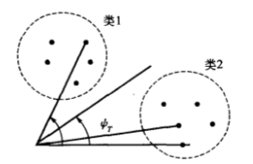
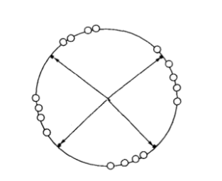
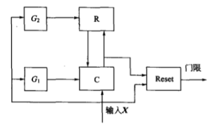
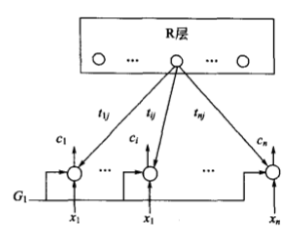
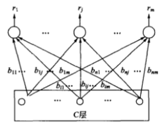

# 竞争学习神经网络

采用有监督学习规则的神经网络要求对所学习的样本给出“正确答案”，以便网络据此判断输出的误差，根据误差的大小改进自身的权值，提高正确解决问题的能力。然而在很多情况下，人在认知过程中没有预知的正确模式，人获得大量知识常常是靠“无师自通”，即通过对客观事物的反复观察、分析与比较，自行揭示其内在规律，并对具有共同特征的事物进行正确归类。对于人的这种学习方式，基于有监督学习策略的神经网络是无能为力的。自组织神经网络的无监督学习方式更类似于人类大脑中生物神经网络的学习，其最重要的特点是通过自动寻找样本中的内在规律和本质属性，自组织、自适应地改变网络参数与结构。这种学习方式大大拓宽了神经网络在模式识别与分类方面的应用。

自组织网络结构上属于层次型网络，有多种类型，其共同特点是都具有竞争层。最简单的网络结构具有一个输入层和一个竞争层，如下图所示。输入层负责接受外界信息并将输入模式向竞争层传递，起“观察”作用，竞争层负责对该模式进行“分析比较”，找出规律以正确归类。这种功能是通过下面要介绍的竞争机制实现的。

## 竞争学习的概念与原理

竞争学习是自组织网络中最常采用的一种学习策略。

### 基本概念

#### 模式、分类、聚类与相似性

在神经网络应用中，输入样本、输入模式、输入模式样本这类术语经常混用。一般当神经网络涉及识别、分类问题时常常用到输入模式的概念。模式是对某些感兴趣的客体的定量描述或结构描述，模式类是具有某些共同特征的模式的合。分类是在类别知识等标签信号的指导下，将待识别的输入模式分配到各自的模式类中去。无监督指导的分类称为聚类，聚类的目的是将相似的模式样本划归一类，而将不相似的分离开，其结果实现了模式样本的类内相似性和类间分离性。通过聚类，可以发现原始样本的分布与特性。

由于无监督学习的训练样本中不含有期望输出，因此对于某一输入模式样本应属于哪类并没有任何先验知识。对于一组输入模式，只能根据它们之间的相似程度分为若干类，因此相似性是输入模式的聚类依据。关于聚类分析的研究，需要解决的问题是：如何决定相似度；如何决定聚类的类别数；如何决定哪种分类的结果是理想的。

#### 相似性测量

神经网络的输入模式用向量表示，比较两个不同模式的相似性可转化为比较两个向量的距离，因而可用模式向量间的距作为聚类判据。传统模式识别中常用到的两种聚类判据是欧式距离法和余弦法。下面分别予以介绍:

(1)欧式距离法为了描述两个输入模式的相似性，常用的方法是计算其欧式距离，即:

$$ \vert \vert X - X_i \vert \vert = \sqrt{(X - X_i)^T(X - X_i)} \tag 1 $$

两个模式向量的欧式距离越小，两个向量越接近，因此认为这两个模式越相似，当两个模式完全相同时其欧式距离为零如果对同一类内各个模式向量间的欧式距离作出规定，不允许超过某一最大值T，则最大欧式距离T就成为一种聚类判据。从下图可以看出同类模式向量的距离小于T，两类模式向量的距离大于T。

(2)余弦法描述两个模式向量的另一个常用方法是计算其夹角的余弦，即:

$$ cos ψ = \frac{X^T X_i}{\vert \vert X \vert \vert \quad \vert \vert X_i \vert \vert} \tag 2 $$

从下图可以看出，两个模式向量越接近，其夹角越小，余弦越大。当两个模式方向完全相同时，其夹角余弦为1。如果对同一类内各个模式向量间的夹角作出规定，不允许超过某一最大角ψ，则最大夹角中就成为一种聚类判据。同类模式向量的夹角小于ψ，两类模式向量的夹角大于中。余弦法适合模式向量长度相同或模式特征只与向量方向相关的相似性测量。

(3)内积法描述两个模式向量的第三种常用方法是计算其内积，即:

$$ X^T X_i = \vert \vert X \vert \vert \quad \vert \vert X_i \vert \vert cos ψ $$

内积值越大则相似度越高，当两个模式方向完全相同且长度相等时，其相似度取最大值。

不同的相似度会导致所形成之聚类几何特性不同。如下图所示，若用欧式距离法度量相似度，会形成大小相似且紧密的圆形聚类；若用余弦法度量相似度，将形成大体同向的狭长形聚类。倘若用内积法度量相似度，则不一定会形成大体同向的狭长形聚类，因为即使两个向量角度几乎相同，但其长度有很大差别，其内积值仍会有较大差异。

#### 侧抑制与竞争

实验表明，在人眼视网膜、脊髓和海马中存在一种侧抑制现象，即当一个神经细胞兴奋后，会对其周围的神经细胞产生抑制作用。这种侧抑制使神经细胞之间呈现出竟争，开始时可能多个细胞同时兴奋，但一个兴奋程度最强的神经细胞对周围神经细胞的抑制作用也越强，其结果使其周围神经细胞兴奋度减弱，从而该神经细胞是这次竞争的“胜者”，而其他神经细胞在竞争中失败。图1.1，即本文最上面的图中的虚线表示了相互抑制的权值。这类抑制性权值常满足一定的分布关系，如距离近的抑制强，距离远的抑制弱。由于权值一般是固定的，训练过程中不需要调整，在各类自组织网络拓扑图中般予以省略。最强的抑制作用是竞争获胜者“唯我独兴”，不允许其他神经元兴奋，这种做法称为胜者为王。

#### 向量归一化

不同的向量又长短和方向的区别，向量归一化的目的是将向量变成方向不变长度为1的单位向量。二维和三位向量可以在单位元和单位球上直观表示。单位向量进行比较时，只需比较向量的夹角。向量的归一化按下式进行：

$$ \hat X = \frac{X}{\vert \vert X \vert \vert} = (\frac{x_1}{\sqrt{\sum_{j=1}^n x_j^2}} \dots \frac{x_n}{\sqrt{\sum_{j=1}^n x_j^2}})^T \tag 3 $$

式中，归一化后的向量用“ $ \hat{} $ ”标记

### 竞争学习原理

竞争学习采取的规则是胜者为王。

#### 竞争学习规则

在竞争学习策略中采用的典型学习规则称为胜者为王。该算法可分为三个步骤：

（1）向量归一化  首先将自组织网络的当前输入模式向量 $ X $ 和竞争层中各神经元对应的内星向量 $ W_j (j=1,2,\dots,m) $ 全部进行归一化，得到 $ \hat{X} $ 和 $ \hat{W}_j (j=1,2,\dots,m) $。

（2）寻找获胜神经元  当网络得到一个输入向量 $ \hat{X} $ 时，竞争层的所有神经元对应的内星权向量 $ \hat{W}_j (j=1,2,\dots,m) $ 均与 $ \hat{X} $ 进行相似性比较，将与 $ \hat{X} $ 最相似的内星权向量判为竞争获胜神经元，其权向量记为 $ \hat{W_j}' $ 。测量相似性的方法是对 $ \hat{W_j} $ 和 $ \hat{X} $ 计算欧式距离或夹角余弦：

$$ \vert \vert \hat{X} - \hat{W_j}' \vert \vert = \min_{j \in \{1,2,\dots,m\}} \{ \vert \vert \hat{X} - \hat{W_j} \vert \vert \} \tag 4 $$

将上式展开并利用单位向量的特点可得：

$$ \vert \vert \hat{X} - \hat{W_j}' \vert \vert = \sqrt{(\hat{X} - \hat{W_j}')^T(\hat{X} - \hat{W_j}')} = \sqrt{\hat{X}^T \hat{X} - 2\hat{W_j'}^T \hat{X} + \hat{W_j'}^T \hat{W_j'}} = \sqrt{2(1 - \hat{W_j'}^T \hat{X})} $$

从上式可以看出，欲使两向量欧式距离最小，需使两向量的点积最大，即：

$$ \hat{W_j'}^T \hat{X} = \max_{j \in \{1,2,\dots,m\}} (\hat{W_j}^T \hat{X}) \tag 5 $$

欲使按式(4)求最小欧式距离的问题就转化为按式(5)求最大点积的问题，而权向量与输入向量的点积正式竞争层神经元的净输入。

（3）网络输出与权值调整

胜者为王竞争学习算法规定，获胜神经元输出为1，其余输出为0.即：

$$ o_j(t+1) = \left\{
\begin{aligned}
1 \quad j = j' \\
0 \quad j \neq j'
\end{aligned}
\right. $$

只有获胜神经元才有权调整其权向量 $ W_j' $ ，调整后权向量为：

$$ \left\{
\begin{aligned}
W_j'(t+1) = \hat{W_j}'(t) + \Delta W_j' = \hat{W_j}'(t) + \alpha (\hat{X} - \hat{W_j}') \quad  j = j' \\
W_j(t+1) = \hat{W_j}(t) \quad j \neq j'
\end{aligned}
\right. $$

式中， $ \alpha \in (0, 1] $ 为学习率，一般其值随着学习进展而减小。可以看出，当 $ i \neq j' $ 时，对应的神经元的权值得不到调整，其实质是“胜者”对他们进行了强侧抑制，不允许他们兴奋。

应当指出，归一化后的权向量经过调整后得到的新向量不再是单位向量，因此需要对调整后的向量进行重新归一化。步骤（3）完成后回到步骤（1）继续训练，知道学习率 $ \alpha $ 衰减到0.

#### 竞争学习的原理

设输入模式为2维向量，归一化后其矢端可以看成分布在下图单位圆上的点，用“o”表示。设竞争层有4个神经元，对应的4个内星向量归一化后也标在同一单位圆上，用“·”表示。从输入模式点的分布可以看出，它们大体上聚集为4簇，因而可以分为4类。然而自组织网络的训练样本中只提供了输入模式而没有提供关于分类的指导信息，网络是如何通过竞争机制自动发现样本空间的类别划分呢?

自组织网络在开始训练前先对竞争层的权向量进行随机初始化。因此在初始状态时，单位圆上的·是随机分布的。前面已经证明，两个等长向量的点积越大，两者越近似，因此以点积最大获胜的神经元对应的权向量应最接近当前输入模式。从上图可以看出，如果当前输入模式用空心圆表示，单位圆上各·点代表的权向量依次同○点代表的输入向量比较距离，结果是离得最近的那个·点获胜。从获胜神经元的权值调整式可以看出，调整的结果是使 $ W_m $ 进一步接近当前输入 $ X $。这一点从下图的向量合成图上可以看得很清楚。调整后，获胜·点的位置进一步移向O点及其所在的簇。显然，当下次出现与○点相像的同簇内的输入模式时，上次获胜的·点更容易获胜。依此方式经过充分训练后，单位圆上的4个·点会逐渐移人各输入模式的簇中心，从而使竞争层每个神经元的权向量成为输入模式一个聚类中心。当向网络输入一个模式时，竟争层中哪个神经元获胜使输出为1，当前输入模式就归为哪类。

## 自组织特征映射神经网络

自组织神经网络（self-organizing feature map，简称SOM）是根据人脑自组织特性提出来的，一个神经网络接受外界输入模式时，将会分为不同的对应区域，各区域对输入模型具有不同的响应特征，而且这个过程是自动完成的。

### SOM网的生物学基础

生物学研究的事实表明，在人脑的感觉通道上，神经元的组织原理是有序排列。因此当人脑通过感官接受外界的特定时空信息时，大脑皮层的特定区域兴奋，而且类似的外界信息在对应区域是连续映象的。例如，生物视网膜中有许多特定的细胞对特定的图形比较敏感，当视网膜中有若干个接收单元同时受特定模式刺激时，就使大脑皮层中的特定神经元开始兴奋，输入模式接近，对应兴奋神经元也相近。在听觉通道上，神经元在结构排列上与频率的关系十分密切，对于某个频率，特定的神经元具有最大的响应，位置邻近的神经元具有相近的频率特征，而远离的神经元具有频率特征差别也较大。大脑皮层中神经元的这种响应特点不是先天安排好的，而是通过后天的学习自组织形成的。

对于某一图形或某一频率的特定兴奋过程是自组织特征映射网中竞争机制的生物学基础。而神经元的有序排列以及对外界信息的连续映象在自组织特征映射网中也有反映，当外界输入不同的样本时，网络中哪个位置的神经元兴奋开始是随机的，但自组织训练后会在竞争层形成神经元的有序排列，功能相近的神经元非常靠近，功能不同的神经元离得较远。这一特点与人脑神经元的组织原理十分相似。

### SOM网的拓扑结构和权值调整域

#### 拓扑结构

SOM网共有两层，输入层各神经元通过权向量将外界信息汇集到输出层的各神经元。输入层的形式与BP网相同，节点数与样本维数相等。输出层也是竞争层，神经元的排列有多种形式，如一维线阵、二维平面阵和三维栅格阵。常见的是前两种类型，下面分别予以介绍。

输出层按一维阵列组织的SOM网是最简单的自组织神经网络，其结构特点与下图左中的网络相同，图4.6中的一维阵列SOM网的输出层只标出相邻神经元间的侧向连接。输出按二维平面组织是SOM网最典型的组织方式，该组织方式更具有大脑皮层的形象。输出层的每个神经元同它周围的其他神经元侧向连接，排列成棋盘状平面，结构如下图右所示。

#### 权值调整域

SOM网采用的学习算法称为 Kohonen算法，是在胜者为王算法基础上加以改进而成的，其主要区别在于调整权向量与侧抑制的方式不同。在胜者为王算法中，只有竞争获胜神经元才能调整权向量，其他任何神经元都无权调整，因此它对周围所有神经元的抑制是“封杀”式的。而SOM网的获胜神经元对其邻近神经元的影响是由近及远，由兴奋逐渐转变为抑制，因此其学习算法中不仅获胜神经元本身要调整权向量，它周围的神经元在其影响下也要程度不同地调整权向量。这种调整可用下图中的三种函数表示，其中下图(b)中的函数曲线是由下图(a)中的两个正态曲线组合而成的。

将下图(b)、(c)和(d)中的三种函数沿中心轴旋转后可形成形状似帽子的空间曲面，按顺序分别称为墨西哥帽函数、大礼帽函数和厨师帽函数。其中墨西哥帽函数是Kohonen提出来的，它表明获胜节点有最大的权值调整量，邻近的节点有稍小的调整量，离获胜节点距离越大，权的调整量越小，直到某一距离R时，权值调整量为零。当距离再远一些时，权值调整量略负，更远时又回到零。墨西哥帽函数表现出的特点与生物系统的十分相似，但其计算上的复杂性影响了网络训练的收敛性。因此在SOM网的应用中常使用与墨西哥函数类似的简化函数，如大礼帽函数和进一步简化的厨师帽函数。

以获胜神经元为中心设定一个邻域半径，该半径圈定的范围称为优胜邻域。在SOM网学习算法中，优胜邻域内的所有神经元均按其离开获胜神经元的距离远近不同程度地调整权值。优胜邻域开始定得很大，但其大小随着训练次数的增加不断收缩，最终收缩到半径为零。

### 自组织特征映射神经网络的运行原理与学习算法

#### 运行原理

SOM网的运行分训练和工作两个阶段。在训练阶段，对网络随机输入训练集中的样本。对某个特定的输入模式，输出层会有某个节点产生最大响应而获胜，而在训练开始阶段，输出层哪个位置的节点将对哪类输入模式产生最大响应是不确定的。当输入模式的类别改变时，二维平面的获胜节点也会改变。获胜节点周围的节点因侧向相互兴奋作用也产生较大响应，于是获胜节点及其优胜邻域内的所有节点所连接的权向量均向输入向量的方向作程度不同的调整，调整力度依邻域内各节点距获胜节点的远近而逐渐衰减。网络通过自组织方式，用大量训练样本调整网络的权值，最后使输出层各节点成为对特定模式类敏感的神经细胞对应的内星权向量成为各输入模式类的中心向量。并且当两个模式类的特征接近时，代表这两类的节点在位置上也接近。从而在输出层形成能够反映样本模式类分布情况的有序特征图。

SOM网训练结束后，输出层各节点与各输入模式类的特定关系就完全确定了，因此可用作模式分类器。当输入一个模式时，网络输出层代表该模式类的特定神经元将产生最大响应，从而将该输入自动归类。应当指出的是，当向网络输入的模式不属于网络训练时见过的任何模式类时，SOM网只能将它归入最接近的模式类。

#### 学习算法

对应上述的学习原理的算法称为 Kohonen 算法，按以下步骤进行：

（1）初始化 对输出层各权向量赋小随机数并进行归一化处理，得到 $ \hat{W_j}, j=1,2,\dots,m $ ；建立初始优胜邻域 $ N_{j'}(0) $ ；学习率 $ \eta $ 赋初始值。

（2）接受输入 从训练集中随机选取一个输入模式并进行归一化处理，得到 $\hat{X^p},p \in \{1,2,\dots,P\} $ 。

（3）寻找获胜节点 计算 $ \hat{X^p} $ 与 $ \hat{W_j} $ 的点积， $ j=1,2,\dots,m $ ，从中选出点积最大的获胜节点 $ j' $ ；如果输入模式未归一化，应按照欧式距离进行计算，从中找出最小的获胜节点。

（4）定义有声邻域 $ N_{j'}(t) $  以 $ j' $ 为中心确定 t 时刻的权值调整域，一般初始邻域 $ N_{j'}(0) $ 较大，训练过程中 $ N_{j'}(t) $ 随训练时间逐渐收缩。

（5）权值调整 对优胜邻域 $ N_{j'}(t) $ 内所有节点调整权值：

$$ w_{ij}(t+1) = w_{ij}(t) + \eta(t,N)[x_i^p - w_{ij}(t)] \quad i=1,2,\dots,n;j \in N_{j'}(t) $$

式中， $ \eta(t,N) $ 是训练时间 t 和邻域内第 j 个神经元与获胜神经元 $ j' $ 之间的拓扑距离 N 的函数，该函数一般有以下规律：

$$ t \uparrow \quad \rightarrow \quad \eta \downarrow, \quad N \uparrow \quad \rightarrow \quad \eta \downarrow $$

很多函数都能满足以上规律，例如可构造如下函数：

$$ \eta(t,N) = \eta(t) e^{-N} $$

式中， $ \eta(t) $ 可采用 t 的单调下降函数。这种随时间单调下降的函数也成为退火函数。

（6）检查结束 SOM网的训练不存在类似 BP 网中的输出误差概念，训练合适结束是以学习率是否衰减到0或某个预定的正小数未条件，不满足结束条件则回到步骤（2）。

#### 功能分析

（1）SOM网的功能特点之一是保序映射。即能将输入空间的样本模式类有序地映射在输出层上。

（2）SOM网的功能特点之二是数据压缩。数据压缩
是指将高维空间的样本在保持拓扑结构不变的条件下投影到低维空间。在这方面，SOM网具有明显的优势。无论输入样本空间是多少维的，其模式样本都可以在SOM网输出层的某个区域得到响应。SOM网经过训练后，在高维空问相近的输入样本，其输出响应节点的位置也接近。因此，对于任意n维输入空间的样本，均可通过投影到SOM网的一维或二维输出层上完成数据压缩。

（3）SOM网的功能特点之三是特征抽取。从特征抽取的角度看高维空间样本向低维空间的映射，SOM网的输出层相当于低维特征空间。在高维模式空间，很多模式的分布具有复杂的结构，从数据观察很难发现其内在规律。当通过SOM网映射到低维输出空间后，其规律往往一目了然，因此这种映射就是一种特征抽取。高维空间的向量经过特征抽取后可以在低维特征空间更加清晰地表达，因此映射的意义不仅仅是单纯的数据压缩，更是一种规律发现。

## 自组织特征映射网络的设计与应用

### SOM网的设计基础

SOM网输入层的设计与BP网相似，而输出层的设计以及网络参数的设计比BP网复杂得多，是网络设计的重点。

#### 输出层的设计

输出层的设计涉及两个问题:一个是节点数的设计；另一个是节点排列的设计。节点数与训练集样本有多少模式类有关。如果节点数少于模式类数，则不足以区分全部模式类，训练的结果势必将相近的模式类合并为一类。这种情况相当于对输入样本进行“粗分”。如果节点数多于模式类数，一种可能是将类别分得过细，而另一种可能是出现“死节点”，即在训练过程中，某个节点从未获胜过且远离其他获胜节点，因此它们的权向量从未得到过调整。在解决分类问题时，如果对类别数没有确切信息，宁可先设置较多的输出节点，以便较好地映射样本的拓扑结构，如果分类过细，再酌情减少输出节点。“死节点”问题一般可通过重新初始化权值得到解决。

输出层的节点排列成哪种形式取决于实际应用的需要，排列形式应尽量直观反映出实际问题的物理意义。例如，对于旅行路径类的问题，二维平面比较直观；对于一般的分类问题，一个输出节点就能代表一个模式类，用一维线阵意义明确且结构简单；而对于机器人手臂控制问题,按三维栅格排列的输出节点更能反映出手臂运动轨迹的空间特征。

#### 权值初始化问题

SOM网的权值一般初始化为较小的随机数，这样做的目的是使权向量充分分散在样本空间。但在某些应用中，样本整体上相对集中于高维空间的某个局部区域，权向量的初始位置却随机地分散于样本空间的广阔区域，训练时必然是离整个样本群最近的权向量被不断调整，并逐渐进入全体样本的中心位置，而其他权向量因初始位置远离样本群而永远得不到调整。如此训练的结果可能使全部样本聚为一类。解决这类问题的思路是尽量使权值的初始位置与输入样本的大致分布区域充分重合。显然，当初始权向量与输入模式向量整体上呈混杂状态时，不仅不会出现所有样本聚为一类的情况，而且会大大提高训练速度。

根据上述思路，一种简单易行的方法是从训练集中随机抽出m个输入样本作为初始权值，即：

$$ W_j(0) = X^{k_{ram}} \quad j=1,2,\dots,m $$

式中， $ k_{ram} $ 是输入样本顺序随机数， $ k_{ram} \in \{1,2,\dots,P\} $ 。因为任何 $ X^{k_{ram}} $ 一定是输入空间某个模式类的成员，各个权向量按上式初始化后从训练一开始就分别接近了输入空间的各模式类，占据了十分有利的“地形”。另外一种可行的办法是先计算出全体样本的中心向量：

$$ \bar{X} = \frac{1}{P} \sum_{p=1}^P X^p $$

在该中心向量基础上叠加小的随机数作为权向量初始值，也可以将权向量初始位置确定在样本群中。

#### 优胜邻域 $ N_{j'}(t) $ 的设计

优胜邻域 $ N_{j'}(t) $ 的设计原则是使邻域不断缩小，这样输出平面上的相邻神经元对应的权向量之间既有区别又有相当的相似性，从而保证当前获胜节点对某一类模式产生最大的响应时，其临近节点也能产生较大响应。邻域的形状可以是正方形、六边形或圆形。

优胜邻域的大小用邻域半径表示，$ r(t) $ 的设计目前还没有一般化的数学方法，通常凭借经验选择。常用的有：

$$ r(t) = C_1 (1 - \frac{t}{t_m}) $$

$$ r(t) = C_1 exp(\frac{-B_1 t}{t_m}) $$

式中， $ C_1 $ 为与输出层节点数 $ m $ 又关的正常数； $ B_1 $ 为大于 1 的常数； $ t_m $ 为预先选定呃最大训练次数。

#### 学习率 $ \eta (t) $ 的设计

$ \eta (t) $ 是网络在 t 时刻的学习率，在训练开始时 $ \eta (t) $ 可以取值较大，之后以较快的速度下降，这样有利于捕捉到输入的大致结构。然后 $ \eta (t) $ 又在较小的值上缓降至 0 值，这样可以精细地调节权值使之符合输入空间的样本分布结构，按此规律变化的 $ \eta (t) $ 表达式如下：

$$ \eta (t) = C_2 (1 - \frac{t}{t_m}) $$

还有一种 $ \eta (t) $ 随训练时间线性下降至 0 值的规律：

$$ \eta (t) = C_2 exp(\frac{-B_2 t}{t_m}) $$

式中， $ C_2 $ 为 0 ~ 1 之间的常数； $ B_2 $ 为大于 1 的常数。

#### SOM网的局限性

- 隐层神经元数目难以确定，因此隐层神经元往往未能充分利用，某些距离学习向量远的神经元不能获胜，从而成为死节点；

- 聚类网络的学习率需要人为确定，学习终止往往需要人为控制，影响学习进度；

- 隐层的聚类结果与初始权值有关。

### 设计与应用实例

- SOM网用于物流中心城市分类评级

- SOM网用户遥感影像分类

- SOM网用于皮革外观效果分类

- SOM网用于火焰燃烧诊断

## 自适应共振理论

1976年，美国 Boston 大学学者 G.A.Carpenter 提出自适应共振理论(adaptive reso-nance theory，ART)，他多年来一直试图为人类的心理和认知活动建立统一的数学理论，ART就是这一理论的核心部分。随后G.A. Carpenter又与S. Grossberg提出了ATR网络。经过了多年的研究和不断发展，ART网已有3种形式:ARTI型处理双极型或二进制信号;ARTⅡ型是ARTI的扩展形式，用于处理连续型模拟信号;ARTⅢ型是分级搜索模型，它兼容前两种结构的功能并将两层神经元网络扩大为任意多层神经元网络。由于ART Ⅲ型在神经元的运行模型中纳入了生物神经元的生物电化学反应机制，因而具备了很强的功能和可扩展能力。

前面介绍的神经网络根据学习方式可分为有监督学习和无监督学习两类。对于有监督学习网络，通过对网络反复输入样本模式使其达到稳定记忆后，如果再加入新的样本继续训练，前面的训练结果就会受到影响。对于无监督学习网络，输入新数据将会对某种聚类典型向量进行修改，这种修改意味着对新知识的学习会带来对旧知识的忘却。事实上，许多无监督学习网络的权值调整式中都包含了对数据的学习项和对旧数据的忘却项，通过控制其中的学习系数和忘记系数的大小来达到某种折中。但是，如何确定这些系数的相对大小，目前尚无通用方法。因此，无论是有监督学习还是无监督学习，由于给定网络的规模是确定的，因而由矩阵W所能记忆的模式类别信息总是有限的，新输入的模式样本必然会对已经记忆的模式样本产生抵消或遗忘，从而使网络的分类性能受影响。靠无限扩大网络规模解决上述问题是不现实的。

如何保证在适当增加网络规模的同时，在过去记忆的模式和新输入的训练模式之间作出某种折中，既能最大限度地接收的模式信息(灵活性)，同时又能保证较少地影响过去的模式样本(稳定性)呢?ART网较好地解决了稳定性和灵活性兼顾的问题。ART网络及算法在适应新的输入模式方面具有较大的灵活性，同时能够避免对网络先前所学模式的修改。解决这一两难问题的思路是，当网络接受来自环境的输入时，按预先设计的参考门限检查该输入模式与所有存储模式类典型向量之间的匹配程度，以确定相似度。对相似度超过参考门限的所有模式类，选择最相似的作为该模式的代表类，并调整与该类别相关的权值，以使以后与该模式相似的输入再与该模式匹配时能得到更大的相似度。若相似度都不超过参考门限，就需要在网络中设立一个新的模式类，同时建立与该模式类相连的权值，用以代表和存储该模式以及后来输入的所有同类模式。

### ART Ⅰ 型网络

#### 网络系统结构

从上图给出的ART模型结构可以看出，该模型的结构与前面出现过的网络拓扑结构有较大区别。ARTI网络由两层神经元构成两个子系统，分别称为比较层C（或称注意子系统）和识别层R（或称取向子系统）。此外还有3种控制信号：复位信号（简称 Reset），逻辑控制信号 $ G_1 $ 和 $ G_2 $ 。下面对上图中各部分功能作一介绍：

（1）C层结构  C层展开后的结构如下图所示，该层有n个节点，每个节点接受来自3个方面的信号：一个是来自外界的输入信号 $ x_i $ ；另一个是来自R层获胜神经元的外星向量 $ T_j' $ 的返回信号 $ t_{ij}' $ ；还有一个是来自 $ G_1 $ 的控制信号。C层节点的输出是根据2/3的“多数表决”原则产生的，即输出值 $ c_i $ 与 $ x_i $ 、 $ t_{ij}' $ 、 $ G_1 $ 3个信号中的多数信号值相同。

网络开始运行时， $ G_1 = 1 $ ，识别层尚未产生竟争获胜神经元，因此反馈回送信号为0。由2/3规则知，C层输出应由输入信号决定，有 $ C = X $ 。当网络识别层出现反馈回送信号时 $ G_1 = 0 $ ，由2/3规则，C层输出应取决于输入信号与反馈信号的比较情况，如果 $ x_i = t_{ij}' $ 则 $ c_i = x_i $ ；否则 $ c_i = 0 $ 。可以看出，控制信号 $ G_1 $ 的作用是使比较层能够区分网络运行的不同阶段，网络开始运行阶段 $ G_1 $ 的作用是使C层对输入信号直接输出；之后 $ G_1 $ 的作用是使C层行使比较功能，此时 $ c_i $ 为对 $ x_i $ 和 $ t_{ij}' $ 的比较信号，两者为 1 时 $ c_i $为 1，否则为 0 。可以看出，从R层返回的信号 $ t_{ij}' $ 对C层输出又调节作用。

（2）R层结构  R层展开后的结构如下图所示，其功能相当于一种前馈竞争网。设R层有m个节点，用以表示m个输入模式类。m可动态增长，以设立新模式类。由C层向上连接到R第j个节点的内星权向量用 $ B_j=(b_{1j},b_{2j},\dots,b_{nj}) $ 表示。C层的输出向量C沿m个内星权向量 $ B_j(j=1,2,\dots,m) $ 向前传送，到达R层各个神经元节点后经过竟争再产生获胜节点 $ j' $，指示本次输入模式的所属类别。获胜节点输出 $ r_j'= 1 $ ，其余节点输出为0。R层的每个神经元都对应两个权向量：一个是将C层前馈信号汇聚到R层的内星权向量$ B_j $ ；另一个是将R层反馈信号散发到C层的外星权向量 $ T_j $ ，该向量为对应与R层各模式类节点的典型向量。

（3）控制信号  3个控制信号的作用分别是：信号 $ G_2 $ 检测输入模式X是否为0，它等于X各分量的逻辑“或”，如果 $ x_i(i=1,2,\dots,n) $ 全为0，则 $ G_2 = 0 $ ，否则 $ G_2 = 1 $。设R层输出向量各分量的逻辑“或”用 $ R_0 $ 。表示，则信号 $ G_1 = G_2 \bar{R_0} $ ，当R层输出向量R的各分量全为0而输入向量X不是零向量时，$ G_1 = 1 $，否则 $ G_1 = 0 $。正如前面所指出的，G1的作用是在网络开始运行时为1，以使 C=X；其后为0，以使C值由输入模式和反馈模式的比较结果决定。Reset信号的作用是使R层竞争获胜神经元无效，如果根据某种事先设定的测量标准， $ T_j' $ 与 $ X $ 未达到预先设定的相似度 $ \rho $ ，表明两者未充分接近，于是系统发出Reset信号使竞争获胜神经元无效。

#### 网络运行原理

网络运行时接受来自环境的输入模式，并检查输入模式与R层所有模式类之间的匹配程度。对于匹配程度最高的模式类，网络要继续考察该模式的典型向量与当前输入模式的相似程度。相似程度按照预先设计的参考门限来考察，可能出现的情况无非有两种。①如果相似度超过参考门限，选该模式类作为当前输入模式的代表类。权值调整规则是，相似度超过参考门限的模式类调整其相应的内外星权向量，以使其以后遇到与当前输入模式接近的样本时能得到更大的相似度;对其他权值向量则不作任何变动。②如果相似度不超过门限值，则对R层匹配程度次高的模式类进行相似程度考察，若超过参考门限网络的运行回到情况①，否则仍然回到情况②。可以想到，运行反复回到情况②意味这最终所有的模式类与当前输入模式的相似度都没有超过参考门限，此时需在网络输出端设立一个代表新模式类的节点，用以代表及存储该模式，以便于参加以后的匹配过程。网络对所接收的每个新输入样本，都进行上面的运行过程。对于每一个输入，模式网络运行过程可归纳为四个阶段：

（1）匹配阶段

网络在没有输入模式之前出于等待状态，此时输入端 $ X = 0 $ ，因此信号 $ G_2 = 0, R_0 = 0 $ 。当输入不全为0的模式 $ X $ 时， $ G_2 = 1, R_0 = 0 $ ，使得 $ G_1 = G_2 \bar{R_0} = 1 $ 。 $ G_1 $ 为1时允许输入模式直接从C层输出，并向前传至R层，与R层节点对应的所有内星向量 $ B_j $ 进行匹配计算：

$$ net_j = B_j^T X = \sum_{i = 1}^n b_{ij} x_i \quad j = 1,2,\dots,m $$

选择具有最大匹配度（即具有最大点积）的竞争获胜节点： $ net_j' = \max_j \{net_j\} $ ，使获胜节点输出 $ r_j' = 1 $ ，其他节点输出为0.

（2）比较阶段

R层输出信息通过外星向量返回到C层。 $ r_j' = 1 $ 使R层获胜几点所连的外星权向量 $ T_j' $ 激活，从节点 $ j' $ 发出n个权信号 $ t_{ij}' $ 返货到C层的n个节点。此时，R层输出不全为0， $ R_0 = 1 $ ，而 $ G_1 = G_2 \bar{R_0} = 0 $ ，所以C层最新输出状态 $ C' $ 取决于由R层返回的外星权向量 $ T_j' $ 和网络输入模式 $ X $ 的比较结果，即 $ c_i = t_{ij}' x_i, i=1,2,\dots,n $ 。由于外星权向量 $ T_j' $ 是R层模式类的典型向量，该比较结果 $ C' $ 反映了在匹配阶段R层竞争排名第一的模式类的典型向量 $ T_j' $ 和当前输入模式 $ X $ 的相似程度。相似程度的大小可以用相似度 $ N_0 $ 反映，定义为：

$$ N_0 = X^T T_j' = \sum_{i=1}^n t_{ij}' x_i = \sum_{i=1}^n c_i $$

因为输入 $ x_i $ 为二进制数0或1，  实际上表示获胜节点的类别模式典型向量于输入模式样本之间相互重叠的非零分量数。设输入模式样本中的非零分量数为：

$$ N_1 = \sum_{i=1}^n x_i $$

用于比较的警戒门限为 $ \rho $ ，在 0 ~ 1 之间取值。检查输入模式与模式类经典向量之间的相似性是否低于警戒门限，如果有：

$$ N_0 / N_1 < \rho $$

则 $ X $ 与 $ T_j' $ 的相似程度不满足要求，网络发出Reset信号使得第一阶段匹配失败，竞争节点获胜无效，网络进入搜索阶段。如果有：

$$ N_0 / N_1 > \rho $$

则表明 $ X $ 与获胜节点对应的类别模式非常接近，称 $ X $ 与 $ T_j' $ 发生“共振”，第一阶段的匹配有效，网络进入学习阶段。

（3）搜索阶段

网络发出Reset重置信号后即进入搜索阶段，重置信号的作用是使前面通过竞争获胜的神经元受到抑制，并且在后续过程中受到持续的抑制，直到输入一个新的模式为止。由于R层中的竞争获胜的神经元被抑制，从而再度出现 $ R_0=0,G_1=1 $ ，因此网络又重新回到起始的匹配状态。由于上次获胜的节点受到持续的抑制，此次获胜的必然是上次匹配程度排在第二的节点。然后进入比较阶段，将该节点对应的外星权向量 $ T_j' $ 与输入模式进行匹配计算。如果对R层所有的模式类，在比较阶段的相似度检查中相似度都不能满足要求，说明当前输入模式无类可归，需要在网络输出层增加一个节点来代表并存储该模式类，为此将其内星向量 $ B_j' $ 设计成当前输入模式向量，外星向量 $ T_j' $ 各分量全设为1。

（4）学习阶段

### ART Ⅰ 型网络的应用

### ART Ⅱ 型网络

### ART Ⅱ 型网络的应用
