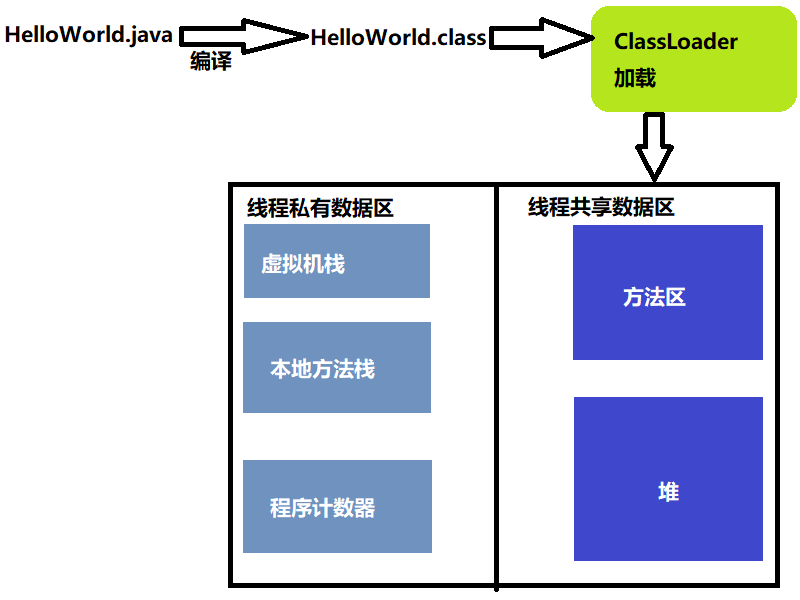

# 运行时内存分配问题

一般来说，大部分Java相关的开发者会笼统的将Java的内存分为**堆内存（heap）**和**栈内存（stack）**。  这种划分的方式一定程度上体现了这两块是Java工程师最关注的两块内存。但是实际上，这种划分方式并不完全准确。

实际上，Java程序在虚拟机中执行的时候，情况比上述更为复杂一些。它会把它所管理的内存，划分为不同的数据区域。例如一个简单的Hello world程序：

`HelloWorld.java`

```java
class HelloWorld {
    public static void main(String[] args) {
        System.out.println("hello, world!");
    }
}
```

当上面`HelloWorld.java`文件被JVM加载到内存，会发生：



1. HelloWorld.java 文件首先需要经过编译器编译，生成 HelloWorld.class 字节码文件。
2. Java 程序中访问HelloWorld这个类时，需要通过 ClassLoader(类加载器)将HelloWorld.class 加载到 JVM 的内存中。
3. JVM 中的内存可以划分为若干个不同的数据区域，主要分为：`程序计数器`、`虚拟机栈`、`本地方法栈`、`堆`、`方法区`。
