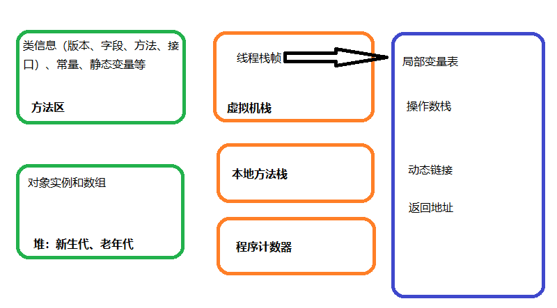

# 运行时内存分配问题

## 1 内存模型

一般来说，大部分Java相关的开发者会笼统的将Java的内存分为**堆内存（heap）**和**栈内存（stack）**。  这种划分的方式一定程度上体现了这两块是Java工程师最关注的两块内存。但是实际上，这种划分方式并不完全准确。

实际上，Java程序在虚拟机中执行的时候，情况比上述更为复杂一些。它会把它所管理的内存，划分为不同的数据区域。例如一个简单的Hello world程序：

`HelloWorld.java`

```java
class HelloWorld {
    public static void main(String[] args) {
        System.out.println("hello, world!");
    }
}
```

当上面`HelloWorld.java`文件被JVM加载到内存，会发生：


1. HelloWorld.java 文件首先需要经过编译器编译，生成 HelloWorld.class 字节码文件。
2. Java 程序中访问HelloWorld这个类时，需要通过 ClassLoader(类加载器)将HelloWorld.class 加载到 JVM 的内存中。
3. JVM 中的内存可以划分为若干个不同的数据区域，主要分为：`程序计数器`、`虚拟机栈`、`本地方法栈`、`堆`、`方法区`。

### 1.1 虚拟机栈

虚拟机栈是线程私有的，与线程的生命周期同步。在 Java 虚拟机规范中，对这个区域规定了两种异常状况：

1. StackOverflowError：当线程请求栈深度超出虚拟机栈所允许的深度时抛出。
2. OutOfMemoryError：当 Java 虚拟机动态扩展到无法申请足够内存时抛出。

我们日常中，所谓 “JVM 是基于栈的解释器执行的， DVM 是基于寄存器解释器执行的”，中的栈指的就是虚拟机栈。虚拟机栈的初衷是为了描述 Java 方法执行的内存模型。每个方法被执行时，JVM 都会在虚拟机栈中创建一个栈帧。

#### 1.1.1 栈帧

栈帧（Stack Frame）是用于支持虚拟机进行方法调用和方法执行的数据结构，每一个线程在执行某个方法时，都会为这个方法创建一个栈帧。

一个线程包含多个栈帧，而每个栈帧内部都包含`局部变量表、操作数栈、动态链接、返回地址等`

#### 1.1.2 局部变量表

局部变量表是变量值的存储空间，我们调用方法时传递的参数，以及在方法内部创建的局部变量都保存在局部变量表中。在Java编译成class文件的时候，就会在方法的Code属性表中的的 max_locals 数据项中，确定该方法需要分配的最大局部变量表的容量。

#### 1.1.3 操作数栈

操作数栈（Operand Stack）也常称为操作栈，它是一个后入先出栈（LIFO）

同局部变量表一样，操作数栈的最大深度也在编译的时候写入方法的Code属性表中的max_stacks数据项中。栈中的元素可以是任意Java数据类型，包括long和double。

当一个方法刚刚开始执行的时候，这个方法的操作数栈是空的。在方法执行的过程中，会有各种字节码指令被压入和弹出操作数栈。

#### 1.1.4 动态链接

动态链接的主要目的是为了支持方法调用过程中的动态连接（Dynamic Linking）。

在一个class文件中，一个方法要想调用其他方法，需要将这些方法在方法区中的符号引用转化为其在内存地址中的直接引用。

在 Java 虚拟机栈中，每个帧都包含一个指向运行时常量池中该栈所属方法的符号引用，持有这个引用的目的就是为了支持方法调用过程中的动态链接。

#### 1.1.5 返回地址

当一个方法开始执行后，只有两种方式可以退出这个方法：

1. 正常退出
2. 异常退出

无论当前方法采用何种方式退出，方法退出后都需要返回方法被调用的位置，程序才能继续执行。而虚拟机栈中的返回地址就是用来帮助当前方法恢复它的上层执行状态。

一般来说，方法正常退出时，调用者的 PC 计数值可以作为返回地址，栈帧中可能保存此计数值。而方法异常退出时，返回地址是通过异常处理器表确定的，栈帧中一般不会保存此部分信息。

### 1.2 本地方法栈

本地方法栈和上面介绍的虚拟机栈基本相同，只不过针对本地（native）方法。在开发中如果接触 JNI 的同学，可能接触本地方法栈多一些，不过现在有些虚拟机已经将本地方法栈和虚拟机栈合二为一了（hotSpot）。

### 1.3 程序计数器

Java 程序可以是多线程，CPU 可以在多个线程执行时间片。当一个线程进入到挂起状态时，需要记录代码已经执行到的位置，方便线程唤醒 CPU 重新执行该线程时，直到从哪行指令开始执行。这个就是程序计数器的作用。

**实际上除了恢复线程的操作之外，其他操作，例如：分支操作、循环操作、跳转、异常处理等也需要这个计数器来完成**

#### 注意

1. 在 Java 虚拟机规范中，对程序计数器这一区域没有规定任何 OutOfMemeryError 的情况。

2. 程序计数器是线程私有的，每一个线程内部都有一个程序计数器。它随着线程创建而创建，随着线程结束而死亡。

3. 当一个线程正在执行一个 Java 方法的时候，这个计数器记录的是正在执行的虚拟机字节码指令的地址。如果正在执行的是 Native 方法，这个计数器值则为空（Undefined）。

### 1.4 方法区

方法区也是 JVM 规范中规定的一块运行时数据区。

方法区主要存储已经被 JVM 加载的类信息（版本、字段、方法、接口）、常量、静态变量、即时编译器编译后的代码和数据。该区域同堆一样，也是被各个线程共享的区域。

#### 1.4.1 与永久区的区别

1. 方法区是 JVM 规范中的一块区域，并不是具体实现。切忌将规范跟实现混为一谈。不同的 JVM 厂商可以有不同版本的“方法区”的实现。

2. HotSpot在JDK1.7以前使用“永久区”（或者叫Perm区）来实现方法区，在JDK1.8之后“永久区”就已经被移除了，取而代之的是一个叫作“元空间（metaspace）”的实现...

总而言之就是：

- 方法区是规范
- 永久区是实现

### 1.5 堆

Java 堆（heap）是 JVM 管理的最大的一片内存区域，该区域的唯一目的是存放对象实例，几乎所有对象的实例都分配在堆中，因此它也是 Java GC 管理的主要区域，有时也叫 “GC堆”。同时也是所有线程共享的内存区域，因此，被分配在该区域的对象要被多个线程访问的话，需要考虑线程安全问题。

按照对象的储存时间不同，堆中的内存又可以划分为`新生代（young）`和`老生代（old）`，其中新生代又分为 Eden 和 Survivor 区。

不同区域存放不同生命周期的对象。这样可以针对不同的区域使用不同的垃圾回收算法，从而更有针对性的提高垃圾回收的效率。

## 2 异常

### 2.1 StackOverflowError 栈溢出

递归调用是造成 StackOverflowError 的一个常见场景。

在方法中如果递归调用了自己，并且未设置递归基或者递归基无法到达，则会产生 StackOverflowError。

原因就是每调用一次method方法时，都会在虚拟机栈中创建出一个栈帧。因为是递归调用，method方法并不会退出，也不会将栈帧销毁，所以必然会导致StackOverflowError。因此当需要使用递归时，需要格外谨慎。

### 2.2 OutOfMemoryError 内存溢出

理论上，虚拟机栈、堆、方法区都有发生OutOfMemoryError的可能。但是实际项目中，大多发生于堆当中。

在一个无限循环中，动态的向ArrayList中添加新的HeapError对象。这会不断的占用堆中的内存，当堆内存不够时，必然会产生OutOfMemoryError，也就是内存溢出异常。

## 3 总结

对于 JVM 运行时内存布局，我们需要始终记住一点：上面介绍的这 5 块内容都是在 Java 虚拟机规范中定义的规则，这些规则只是描述了各个区域是负责做什么事情、存储什么样的数据、如何处理异常、是否允许线程间共享等。千万不要将它们理解为虚拟机的“具体实现”，虚拟机的具体实现有很多，比如 Sun 公司的 HotSpot、JRocket、IBM J9、以及我们非常熟悉的 Android Dalvik 和 ART 等。这些具体实现在符合上面 5 种运行时数据区的前提下，又各自有不同的实现方式。

总结来说，JVM 的运行时内存结构中一共有两个“栈”和一个“堆”，分别是：Java 虚拟机栈和本地方法栈，以及“GC堆”和方法区。除此之外还有一个程序计数器，但是我们开发者几乎不会用到这一部分，所以并不是重点学习内容。 JVM 内存中只有堆和方法区是线程共享的数据区域，其它区域都是线程私有的。并且程序计数器是唯一一个在 Java 虚拟机规范中没有规定任何 OutOfMemoryError 情况的区域。


